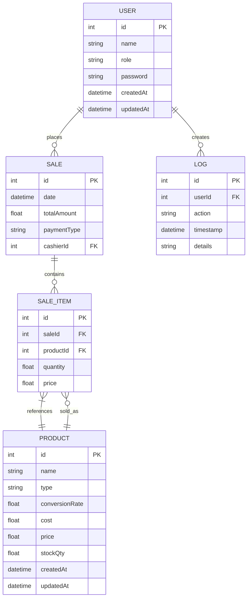

# POS System Database Schema

This document describes the database schema for the POS System application, which uses SQLite with Prisma ORM for data persistence.

## Entity Relationship Diagram



## Table Definitions

### Users Table
Stores information about system users and their roles.

```prisma
model User {
  id        Int      @id @default(autoincrement())
  name      String
  role      String   // admin, cashier, manager
  password  String
  createdAt DateTime @default(now())
  updatedAt DateTime @updatedAt
  sales     Sale[]
  logs      Log[]
}
```

**Fields:**
- `id`: Unique identifier for the user
- `name`: User's full name
- `role`: User's role (admin, cashier, manager)
- `password`: Hashed password for authentication
- `createdAt`: Timestamp when the user was created
- `updatedAt`: Timestamp when the user was last updated
- `sales`: Related sales records (one-to-many)
- `logs`: Related audit logs (one-to-many)

### Products Table
Stores information about products in inventory.

```prisma
model Product {
  id             Int        @id @default(autoincrement())
  name           String
  type           String     @default("unit") // unit, pack, wholesale
  conversionRate Float      @default(1.0)   // for packs/wholesale (e.g., 1 pack = 12 units)
  cost           Float
  price          Float
  stockQty       Float
  createdAt      DateTime   @default(now())
  updatedAt      DateTime   @updatedAt
  saleItems      SaleItem[]
}
```

**Fields:**
- `id`: Unique identifier for the product
- `name`: Product name
- `type`: Product type (unit, pack, wholesale)
- `conversionRate`: Conversion rate for packs/wholesale items
- `cost`: Cost price of the product
- `price`: Selling price of the product
- `stockQty`: Current stock quantity
- `createdAt`: Timestamp when the product was created
- `updatedAt`: Timestamp when the product was last updated
- `saleItems`: Related sale items (one-to-many)

### Sales Table
Stores information about sales transactions.

```prisma
model Sale {
  id          Int        @id @default(autoincrement())
  date        DateTime   @default(now())
  totalAmount Float
  paymentType String     // cash, card, split
  cashierId   Int
  cashier     User       @relation(fields: [cashierId], references: [id])
  saleItems   SaleItem[]
}
```

**Fields:**
- `id`: Unique identifier for the sale
- `date`: Timestamp when the sale was made
- `totalAmount`: Total amount of the sale
- `paymentType`: Payment method (cash, card, split)
- `cashierId`: ID of the user who processed the sale
- `cashier`: Related user record (many-to-one)
- `saleItems`: Related sale items (one-to-many)

### Sale Items Table
Stores individual items within sales transactions.

```prisma
model SaleItem {
  id        Int     @id @default(autoincrement())
  saleId    Int
  sale      Sale    @relation(fields: [saleId], references: [id])
  productId Int
  product   Product @relation(fields: [productId], references: [id])
  quantity  Float
  price     Float
}
```

**Fields:**
- `id`: Unique identifier for the sale item
- `saleId`: ID of the parent sale
- `sale`: Related sale record (many-to-one)
- `productId`: ID of the product sold
- `product`: Related product record (many-to-one)
- `quantity`: Quantity of the product sold
- `price`: Price at the time of sale

### Logs Table
Stores audit trail of system actions.

```prisma
model Log {
  id        Int      @id @default(autoincrement())
  userId    Int
  user      User     @relation(fields: [userId], references: [id])
  action    String
  timestamp DateTime @default(now())
  details   String?
}
```

**Fields:**
- `id`: Unique identifier for the log entry
- `userId`: ID of the user who performed the action
- `user`: Related user record (many-to-one)
- `action`: Description of the action performed
- `timestamp`: When the action was performed
- `details`: Additional details about the action (optional)

## Relationships

1. **User → Sales**: One-to-many relationship (one user can process many sales)
2. **User → Logs**: One-to-many relationship (one user can create many log entries)
3. **Sale → SaleItems**: One-to-many relationship (one sale can contain many items)
4. **Product → SaleItems**: One-to-many relationship (one product can be sold in many sales)
5. **Sale → SaleItems**: One-to-many relationship (one sale can contain many items)

## Indexes

The Prisma schema automatically creates indexes for:
- Primary keys on all tables
- Foreign key relationships
- Timestamp fields

## Sample Data

The database is seeded with sample data including:
- 3 users (admin, cashier, manager)
- 5 products (Coffee, Coffee Pack, Croissant, Sandwich, Wholesale Coffee)
- Sample sales and sale items
- Audit log entries

## Migration Strategy

Database migrations are managed through Prisma's migration system:
1. Schema changes are made in `prisma/schema.prisma`
2. Migrations are generated with `npx prisma migrate dev`
3. Migration files are stored in `prisma/migrations/`
4. Production migrations are applied with `npx prisma migrate deploy`

## Backup and Recovery

The SQLite database file (`prisma/dev.db`) can be backed up by:
1. Copying the file to a secure location
2. Using SQLite's built-in backup utilities
3. Implementing automated backup scripts

For disaster recovery:
1. Restore the database file from backup
2. Run `npx prisma generate` to regenerate the Prisma client
3. Restart the application