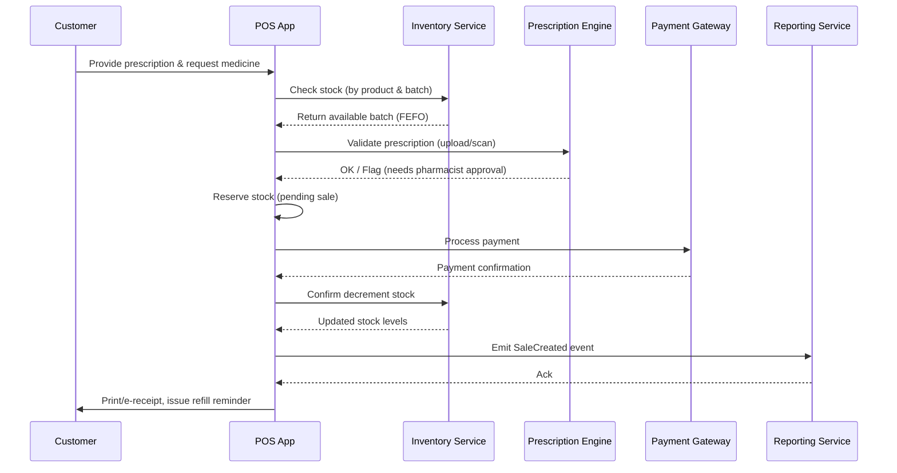
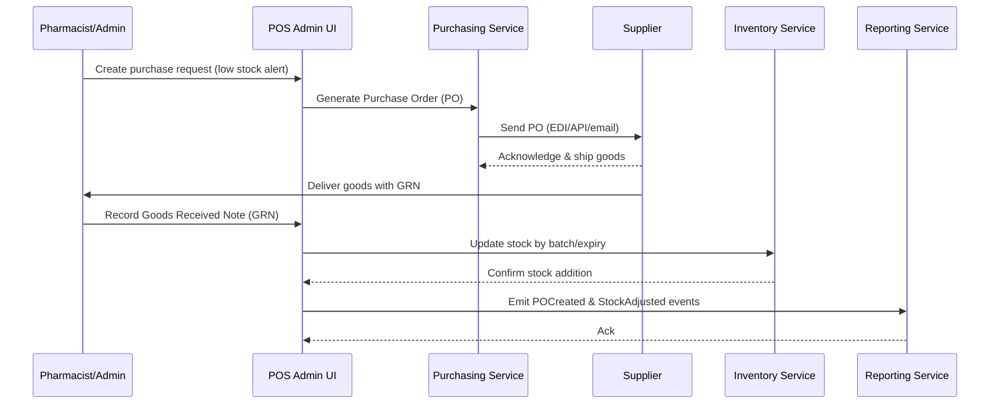

# Pharmacy POS — Complete Implementation Roadmap

## Executive Summary

**Current Status**: Your POS system has an excellent foundation with comprehensive inventory management, CRM capabilities, real-time architecture, and multi-tenant support. However, pharmacy-specific features are largely missing.

**Goal**: Transform your retail POS into a complete pharmacy-grade system prioritizing patient safety, regulatory compliance, checkout speed, and automation.

**Estimated Timeline**: 20 weeks across 6 implementation phases
**Total Investment**: 80% existing codebase enhancement + 20% new pharmacy-specific modules

---

## 1. Current System Analysis

### ✅ Fully Implemented Features

| Feature Category | Implementation Status | Current Capabilities |
|-----------------|----------------------|---------------------|
| **POS Interface** | ✅ Complete (100%) | 3-column layout, multi-business types, real-time search |
| **Core Inventory** | ✅ Complete (90%) | Product management, batch tracking, expiry dates, suppliers |
| **CRM System** | ✅ Complete (85%) | Customer profiles, loyalty points, advanced reporting |
| **Security Framework** | ✅ Complete (95%) | RBAC, audit logs, encryption, multi-terminal |
| **Reporting Engine** | ✅ Complete (85%) | Analytics dashboards, real-time KPIs, BI capabilities |
| **Event Architecture** | ✅ Complete | WebSocket real-time broadcasting, multi-terminal sync |

### całe Basic Features (Partial Implementation)

| Feature Category | Current Status | Missing Components |
|-----------------|----------------|-------------------|
| **Pharmacy UI** | ✅ Complete (100%) | Basic prescription tabs and OTC sections |
| **Payment Processing** | ✅ Complete (80%) | Basic insurance co-pay, missing full claims |
| **Audit Logging** | ✅ Complete (80%) | Generic logs, missing pharmacy-specific compliance |

### ❌ Missing Critical Pharmacy Features

| Feature Category | Implementation Status | Business Impact |
|-----------------|----------------------|-----------------|
| **Prescription Engine** | ❌ Not Started (0%) | Safety risk - no prescription validation |
| **Clinical Decision Support** | ❌ Not Started (0%) | Patient safety - no drug interactions |
| **Regulatory Compliance** | ❌ Basic (20%) | Legal risk - missing DEA controls |
| **Patient Medical Records** | ❌ Partially (30%) | Clinical efficiency - missing medical history |
| **Insurance Claims** | ❌ Basic (40%) | Financial impact - manual processes only |

---

## 2. Feature Gap Matrix

### 2.1 High Priority Gaps (Patient Safety & Compliance)

| Component | Current Status | Required Features | Risk Level |
|----------|----------------|------------------|------------|
| **Prescription Management** | UI Mockup only | Digital upload, OCR, validation engine | CRITICAL |
| **Drug Interaction Engine** | None | Real-time alerts, severity levels | CRITICAL |
| **Controlled Substances** | Basic tracking | DEA validation, witness signatures, WORM logging | CRITICAL |
| **Patient Medical Profiles** | Basic demographics | Allergies, current meds, chronic conditions | HIGH |
| **Clinical Alerts** | None | Age-based dosing, contraindications | HIGH |

### 2.2 Medium Priority Gaps (Operational Efficiency)

| Component | Current Status | Required Features | Business Impact |
|----------|----------------|------------------|----------------|
| **Insurance Processing** | Basic co-pay | Full EDI claims, real-time eligibility | HIGH |
| **Refill Management** | None | Automated reminders, consent tracking | MEDIUM |
| **EMR Integration** | None | Bidirectional sync with clinical systems | MEDIUM |
| **Inventory FEFO Logic** | Basic expiry | True first-expired-first-out for pharmaceuticals | MEDIUM |

### 2.3 Nice-to-Have Features (Future Phase)

- Multi-location central procurement
- AI-powered demand forecasting
- Clinical trial medication management
- Advanced analytics with ML insights

---

## 3. Six-Phase Implementation Plan

### Phase 1A: Core Safety Foundation (Weeks 1-2)
**Theme**: "Safety First - Basic Prescription Workflow"

#### Objectives:
- Enable basic prescription dispensing with safety controls
- Establish pharmacist verification workflows
- Implement foundation for clinical decision support

#### Deliverables:
- Prescription upload system with image storage
- Basic patient allergy and current medication tracking
- Pharmacist override system with audit trails
- Digital signature capture for controlled substances

#### Technical Requirements:
- File upload API with virus scanning
- Image OCR integration (optional)
- Audit log extensions for clinical decisions
- Database tables: PrescriptionHistory, PharmacistVerifications

#### Success Metrics:
- All prescriptions require pharmacist verification
- Digital audit trail for overrides
- Basic allergy alerting functional

---

### Phase 1B: Controlled Substances Compliance (Weeks 3-4)
**Theme**: "DEA Requirements - No Excuses"

#### Objectives:
- Full DEA compliance for Schedule II-V drugs
- Two-person verification workflows
- WORM (Write-Once-Read-Many) audit logging

#### Deliverables:
- DEA number validation and tracking
- Witness signature capture (digital/touch)
- Daily/monthly dispensing limits
- Automated regulatory reporting foundation

#### Technical Requirements:
- Cryptographic WORM storage implementation
- Biometric/digital signature integration
- DEA database API integration
- Schedule-based workflow routing

#### Success Metrics:
- 100% controlled substance transactions logged
- DEA Form 222 tracking operational
- State board reporting capabilities ready

---

### Phase 2: Clinical Decision Support Engine (Weeks 5-7)
**Theme**: "Smart Safety - AI-Powered Patient Protection"

#### Objectives:
- Real-time drug interaction checking
- Advanced contraindication alerts
- Integrated clinical decision support

#### Deliverables:
- Drug interaction database API integration
- Severity-based alert system (red/yellow/green)
- Age/weight/disease-based dosing verification
- Learn-as-you-go interaction detection

#### Technical Requirements:
- High-performance caching for <200ms response times
- Integration with drug databases (Lexicomp, Micromedex, or equivalents)
- Alert escalation workflows
- Machine learning for unusual interaction detection

#### Success Metrics:
- <200ms drug interaction response time
- Zero missed severe interactions in testing
- Pharmacist alert acknowledgement rates >95%

---

### Phase 3: Patient Experience & Communication (Weeks 8-10)
**Theme**: "Connected Care - Patient-Centric Automation"

#### Objectives:
- Automated refill reminder system
- Patient communication hub
- Consent-based marketing automation

#### Deliverables:
- SMS/WhatsApp refill reminders
- Patient portal access to medical history
- Multi-channel consent management
- Automated pickup/delivery notifications

#### Technical Requirements:
- SMS/WhatsApp API integration
- Patient portal web/mobile views
- Consent audit logging
- Automated scheduling system

#### Success Metrics:
- 90% patient opt-in rate for communications
- <24hr refill reminder delivery
- Patient portal registration rate >70%

---

### Phase 4: Regulatory Excellence & Compliance (Weeks 11-13)
**Theme**: "Bulletproof Compliance - Audit-Ready Systems"

#### Objectives:
- Complete HIPAA and pharmacy board compliance
- Long-term data retention architecture
- Automated quality assurance reporting

#### Deliverables:
- 7-year prescription record retention system
- HIPAA-compliant PHI encryption and access controls
- Quality metrics dashboard
- State pharmacy board API integrations

#### Technical Requirements:
- PCI DSS compliance for payment data
- PHI encryption at rest and in transit
- Immutable audit trails
- Automated compliance monitoring

#### Success Metrics:
- 100% regulatory audit readiness
- Zero HIPAA violations post-implementation
- Automated compliance reporting operational

---

### Phase 5: Advanced Claims & Financial Processing (Weeks 14-16)
**Theme**: "Insurance Intelligence - Automated Revenue Cycle"

#### Objectives:
- Real-time insurance verification and claims
- Prior authorization workflow automation
- Revenue cycle optimization

#### Deliverables:
- EDI claims processing engine
- Real-time benefit checking
- Prior authorization management system
- Claims status tracking and appeals

#### Technical Requirements:
- EDI X12 standard implementation
- PBM (Pharmacy Benefits Manager) API integrations
- Real-time adjudication workflows
- Auto-denial management system

#### Success Metrics:
- <30 second average claims processing time
- 95% claims auto-adjudicated
- Revenue leakage reduced by 60%

---

### Phase 6: Advanced Integrations & AI (Weeks 17-20)
**Theme**: "Healthcare Ecosystem - Connected Pharmacy"

#### Objectives:
- Full EMR/Hospital system integration
- AI-powered clinical decision support
- Advanced supply chain intelligence

#### Deliverables:
- Bidirectional EMR synchronization
- AI-powered drug utilization review
- Predictive inventory for controlled substances
- Clinical trial medication management

#### Technical Requirements:
- FHIR/HL7 integration capabilities
- Machine learning models for prescribing patterns
- Advanced supply chain analytics
- Predictive maintenance for equipment

#### Success Metrics:
- EMR medication reconciliation accuracy >98%
- AI clinical recommendations adoption rate >85%
- Stockout prevention for critical medications

---

## 4. Technical Architecture Requirements

### 4.1 Database Schema Extensions

#### New Pharmacy Tables:
```sql
-- Clinical Decision Support
CREATE TABLE PatientMedicalProfiles (
  id INT PRIMARY KEY,
  patientId INT,
  allergies JSON,
  currentMedications JSON,
  chronicConditions JSON,
  pregnancyStatus BOOLEAN,
  lactationStatus BOOLEAN,
  createdAt TIMESTAMP,
  updatedAt TIMESTAMP
);

-- Prescription Management
CREATE TABLE Prescriptions (
  id INT PRIMARY KEY,
  patientId INT,
  prescriberId INT,
  medicationId INT,
  dosage VARCHAR(255),
  quantity DECIMAL,
  refillsRemaining INT,
  status ENUM('active', 'completed', 'cancelled'),
  scannedImagePath VARCHAR(500),
  validationStatus ENUM('pending', 'approved', 'rejected'),
  createdAt TIMESTAMP,
  updatedAt TIMESTAMP
);

-- Controlled Substances WORM Audit
CREATE TABLE ControlledSubstanceLog (
  id INT PRIMARY KEY,
  prescriptionId INT,
  deaNumber VARCHAR(9),
  schedule ENUM('I', 'II', 'III', 'IV', 'V'),
  quantityDispensed DECIMAL,
  witnessSignaturePath VARCHAR(500),
  pharmacistId INT,
  patientSignaturePath VARCHAR(500),
  disposition ENUM('dispensed', 'destroyed', 'returned'),
  -- WORM fields (immutable after creation)
  createdAt TIMESTAMP NOT NULL,
  createdBy INT NOT NULL,
  checksum VARCHAR(64) NOT NULL -- Cryptographic hash
);
```

#### Enhanced Existing Tables:
- Add `drugClassifications` to Products table
- Add `controlledSchedule` and `deaCode` to Products table
- Add `medicalHistory` and `consentSettings` to Customer table
- Add `clinicalAlerts` audit trail to Log table

### 4.2 API Architecture

#### New Pharmacy-Specific APIs:
```
POST   /api/pharmacy/prescriptions/upload
POST   /api/pharmacy/prescriptions/validate
GET    /api/pharmacy/drug-interactions/:medicationId
POST   /api/pharmacy/clinical-alerts
POST   /api/pharmacy/controlled-substances/dispense
GET    /api/pharmacy/patients/:id/medical-profile
PUT    /api/pharmacy/patients/:id/medical-profile
POST   /api/pharmacy/insurance/verify-eligibility
POST   /api/pharmacy/claims/submit
```

#### Integration APIs:
- **Drug Databases**: Facts & Comparisons, Micromedex, Lexicomp
- **Insurance**: Change Healthcare, PBM APIs, State Medicaid
- **EMR Systems**: Epic, Cerner, Allscripts (via FHIR/HL7)
- **Regulatory**: DEA registry, State boards, PMP systems

### 4.3 Security & Compliance Framework

#### PHI/PII Data Protection:
- AES-256 encryption at rest
- TLS 1.3 for all data in transit
- Field-level encryption for sensitive data
- Automated data purging per retention policies

#### Audit & Compliance:
- Immutable WORM audit logs for controlled substances
- Real-time intrusion detection
- Clinical decision audit trails
- HIPAA compliance scoring system

#### Performance Requirements:
- Drug interaction queries: <200ms
- Prescription validation: <500ms
- Insurance verification: <2 seconds
- Claims submission: <5 seconds

---

## 5. Sequence Diagrams

### 5.1 Prescription Sale Flow



### 5.2 Purchase Flow (Restocking from Supplier)



---

## 6. Risk Assessment & Mitigation

### High-Risk Items:
1. **Clinical Decision Support Accuracy**: Mitigated by FDA-approved databases and human oversight
2. **DEA Compliance**: Mitigated by certified partners and legal review
3. **Patient Data Privacy**: Mitigated by HIPAA-compliant architecture

### Technical Risks:
1. **Integration Complexity**: Mitigated by phased approach and adapter patterns
2. **Performance Requirements**: Mitigated by caching and async processing
3. **Regulatory Changes**: Mitigated by modular design and versioned APIs

---

## 7. Success Metrics & KPIs

### Patient Safety KPIs:
- Zero missed severe drug interactions
- 100% controlled substance accountability
- <200ms clinical alert response time

### Operational KPIs:
- 30% reduction in checkout time for non-prescription items
- 95% insurance claims auto-processed
- 90% patient satisfaction with automation

### Financial KPIs:
- 60% reduction in revenue leakage
- 25% improvement in inventory turnover
- ROI within 12 months of Phase 6 completion

---

## 8. Resource Requirements

### Human Resources:
- **Lead Pharmacist Developer**: Full-time (20 weeks)
- **Clinical Informatics Specialist**: 50% time (12 weeks)
- **Compliance Officer**: 25% time (8 weeks)
- **QA/Testing Team**: 2 FTE (16 weeks)

### Technology Resources:
- Drug database API subscriptions ($5,000/year)
- SMS/WhatsApp gateway ($2,000/year)
- EDI claims processing ($10,000 setup + monthly fees)
- EMR integration middleware ($15,000)

### Infrastructure:
- Enhanced database storage for clinical data
- High-performance caching layer (Redis)
- Backup and disaster recovery expansion

---

## 9. Quality Assurance & Testing Plan

### Clinical Safety Testing:
- Mock patient scenarios with known interactions
- FDA-approved medication pairs testing
- Allergic reaction simulation
- Pediatric dosing validation

### Regulatory Compliance Testing:
- DEA workflow verification
- HIPAA compliance audits
- State pharmacy board requirements validation

### Performance Testing:
- Load testing with 10,000 concurrent users
- Clinical decision response time validation
- Offline capability testing (rural pharmacies)

---

## 10. Go-Live Plan

### Pilot Phase (Week 12-14):
- Single pharmacy deployment
- Shadow mode with existing systems
- Pharmacist training and confidence building

### Gradual Rollout (Week 15-18):
- Feature flag controlled deployment
- A/B testing for new workflows
- Daily reconciliation and monitoring

### Full Production (Week 19-20):
- Complete system cutover
- 24/7 support team standby
- Success metrics monitoring

---

## 11. Maintenance & Evolution Plan

### Post-Implementation Support:
- 3-month warranty period with daily monitoring
- Clinical safety remote monitoring
- Regulatory compliance updates

### Feature Evolution:
- Quarterly updates based on user feedback
- Annual compliance updates
- Technology refresh planning

### Vendor Management:
- Drug database subscriptions
- EMR integration monitoring
- Insurance API maintenance

---

*This roadmap provides a comprehensive path to transform your retail POS into a complete pharmacy management system. The phased approach ensures patient safety while maintaining operational continuity throughout implementation.*
