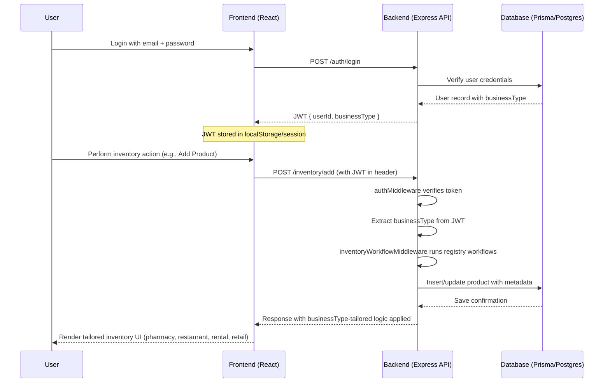

# Multi-Vertical Inventory Configuration

This directory contains configuration files for business-type-specific inventory management. Each vertical gets tailored fields, workflows, themes, and categories.

## ✅ LATEST: Unified Config System (Recommended)

The new **unified config system** (`unifiedConfigs.ts`) is the **SINGLE SOURCE OF TRUTH** for all business-type configurations. It eliminates duplication by defining UI fields, backend workflows, themes, and categories in ONE place.

```typescript
// Import the unified system
import { unifiedConfigs, type InventoryConfig } from './unifiedConfigs';

// Get complete config for any business type
const pharmacyConfig = unifiedConfigs.pharmacy;

// Returns: { businessType, fields: [...], workflows: [...], theme, defaultCategories }
```

**Benefits:**
- 🔄 **Zero Duplication**: One object per business type
- ⚡ **Single Source**: Change config → affects UI + backend
- 🧪 **Type Safe**: Full TypeScript support
- 📈 **Maintainable**: Add business types as simple objects

## 📁 Configuration Files

### 🏥 Pharmacy (`pharmacy.ts`)
- **Fields**: Batch No, Expiry Date, Manufacturer, Prescription Required, Controlled Substance Flag
- **Workflows**: Expiry alerts, controlled substance logs, batch deductions
- **Theme**: Green (medical/healthcare)
- **Categories**: Prescription Drugs, OTC Medicines, Supplements, Medical Devices

### 🍽️ Restaurant (`restaurant.ts`)
- **Fields**: Ingredient Type, Recipe Mapping, Storage Temperature, Supplier Notes
- **Workflows**: Auto-deduct ingredients, forecast runouts, low stock alerts
- **Theme**: Orange (hospitality/food service)
- **Categories**: Ingredients, Beverages, Prepared Foods, Condiments, Supplies

### 🏠 Rental (`rental.ts`)
- **Fields**: Asset Condition, Rental Rate, Contract ID, Deposit Amount, Maintenance Schedule
- **Workflows**: Mark unavailable on rental, condition checks on return, overdue alerts
- **Theme**: Blue (equipment/assets)
- **Categories**: Vehicles, Equipment, Real Estate, Electronics, Tools

### 🛍️ Retail (`retail.ts`)
- **Fields**: Variant Options, Barcode/UPC, Warranty Period, Discount Eligibility, Bundle Pack
- **Workflows**: SKU variant tracking, warranty registration, returns processing
- **Theme**: Gray (general consumer)
- **Categories**: Apparel, Electronics, Home Goods, Beauty & Personal Care, Seasonal Items

## 🔧 How It Works

### 1. **Load Your Config** (Recommended)
```typescript
import { loadInventoryConfig } from '@/configs/inventory';

export function InventoryForm() {
  const businessType = localStorage.getItem('businessType') || 'retail';
  const config = loadInventoryConfig(businessType);

  // Use config.fields, config.workflows, config.theme, etc.
}
```

### 2. **Dynamic UI Rendering**
```typescript
// Form fields adapt per business type
{config.fields.includes('Batch No') && (
  <input name="batchNo" placeholder="DEA Batch Number" />
)}

{config.fields.includes('Recipe Mapping') && (
  <RecipeSelector />
)}

{config.fields.includes('Contract ID') && (
  <ContractLookup />
)}
```

### 3. **Theme Application**
```typescript
// UI styling matches business type
<div className={`rounded-lg shadow p-4 ${config.theme}`}>
  <h2>{config.businessType.toUpperCase()} Inventory</h2>

  {/* Theme classes automatically apply:
     * Pharmacy: bg-green-50 text-green-800 border-l-4 border-green-500
     * Restaurant: bg-orange-50 text-orange-800 border-l-4 border-orange-500
     * Rental: bg-blue-50 text-blue-800 border-l-4 border-blue-500
     * Retail: bg-gray-50 text-gray-800 border-l-4 border-gray-500
  */}
</div>
```

### 4. **Workflow Selection**
```typescript
// Backend processes vertical-specific logic
const handleSaleSubmission = async (saleData) => {
  if (config.workflows.includes('controlled_substance_logs')) {
    await logDEAAudit(saleData);
  }

  if (config.workflows.includes('auto_deduct_recipe')) {
    await deductRecipeIngredients(saleData);
  }

  if (config.workflows.includes('mark_out_of_stock_on_rental')) {
    await markRentalAsUnavailable(saleData);
  }
};
```

## 🎯 Business Logic per Vertical

### Pharmacy Logic
- **Batch Tracking**: Prevents medication mix-ups
- **Expiry Alerts**: Critical for patient safety
- **Controlled Logs**: DEA compliance & audit trails
- **Prescription Links**: Medication ↔ patient tracking

### Restaurant Logic
- **Recipe Deduction**: "Burger" sale → auto-deducts bun + patty + veggies
- **Ingredient Forecasting**: Predicts when lettuce will run out
- **Temperature Control**: Food safety compliance
- **Supplier Preferences**: Brand quality tracking

### Rental Logic
- **Availability Management**: Rental → "Out of Stock"
- **Condition Tracking**: Assess damage on return
- **Contract Integration**: Link rentals to legal agreements
- **Deposit Handling**: Financial protection & claims

### Retail Logic
- **Variant Management**: Track inventory by size/color
- **Warranty Processing**: Service contract management
- **Return Processing**: Stock adjustments for returns
- **Bundle Pricing**: Product combos & promotions

## 🚀 Adding New Verticals

1. **Create config file**: `newvertical.ts`
2. **Define fields/workflows**: Focus on essential business logic
3. **Choose theme**: Select appropriate Tailwind colors
4. **Update index.ts**: Add to exports
5. **Done!** New vertical is fully integrated

## 📊 Architecture Benefits

- **Single Codebase**: 1 inventory system powers all verticals
- **No Code Duplication**: Config-driven customization
- **Pluggable Workflows**: Business-specific logic through registry
- **Type Safety**: Full TypeScript support
- **Infinite Scalability**: Add new verticals with config files
- **Business Logic**: Actually useful features per industry

## 🏗️ **Latest: Workflow Registry Architecture**

**Instead of hardcoded switch statements**, we now use a **pluggable workflow registry**:

```typescript
// Registry-based approach (current)
const workflowRegistry = {
  pharmacy: [
    (req, res, next) => { /* expiry check */ next(); },
    (req, res, next) => { /* batch deduction */ next(); },
    (req, res, next) => { /* DEA logging */ next(); },
  ],
  restaurant: [/* ... */],
  rental: [/* ... */],
  retail: [/* ... */],
};

// Cleaner middleware
export function inventoryWorkflowMiddleware(req, res, next) {
  const businessType = req.user.businessType;
  const workflows = workflowRegistry[businessType] || [];
  runSequentialWorkflows(workflows, () => next());
}
```

**Benefits:**
- 🔧 **Pluggable**: Add/remove workflow steps easily
- 📈 **Extensible**: New business types = new registry entry
- 🧪 **Testable**: Each workflow step individually testable
- 🎯 **Maintainable**: No giant switch statements
- ⚡ **Performance**: Sequential execution without branching

## 🏗️ **Architecture Overview**

This sequence diagram (`business_type_flow.mermaid`) shows the complete end-to-end flow:



This config-first architecture enables **enterprise SaaS scaling** - powering unlimited business models from one platform! 🚀
